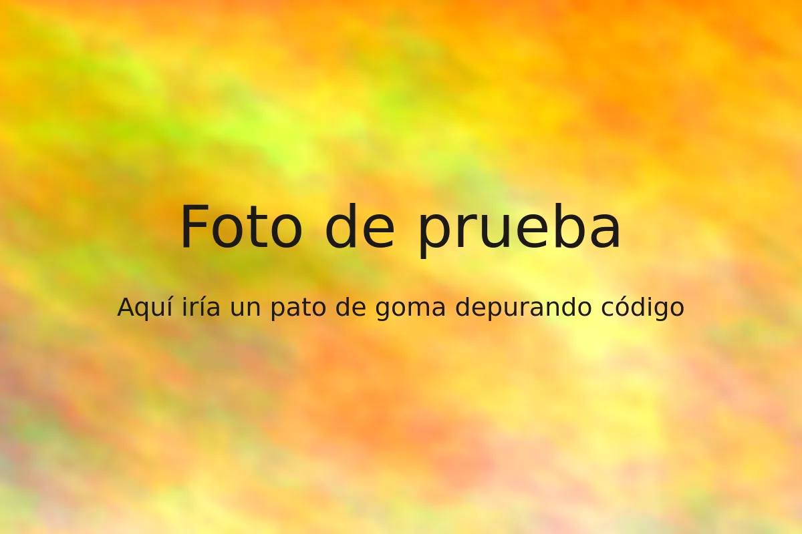
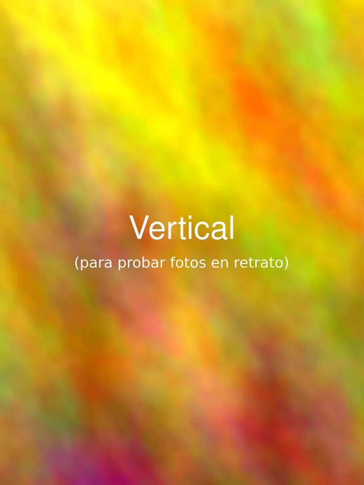
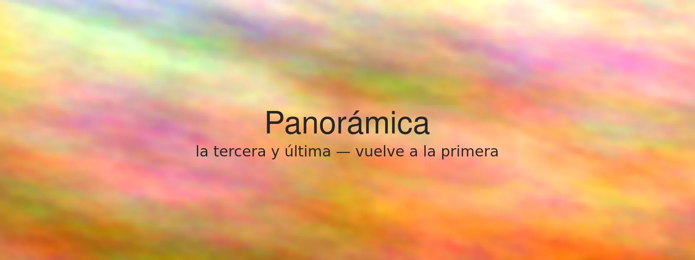

Esto es un **borrador**, así que solo aparece con `astro dev` — el build de
producción lo ignora.



## Escribir una entrada nueva

1. Copia `src/content/blog/example-post/` a `src/content/blog/<tu-slug>/`.
   El nombre de la carpeta es la URL: `/blog/<tu-slug>/`.
2. Escribe `en.md` y `es.md`. Si solo escribes uno, ambos idiomas lo
   muestran con una nota de "solo disponible en…".
3. Pon `draft: false` cuando esté lista.

## Para una charla

Pon `type: talk`, añade el `event` y los `links` que tengas:

```yaml
type: talk
event: "PyData Málaga"
links:
  slides: https://example.com/slides.pdf
  video: https://youtube.com/...
  repo: https://github.com/Pacolias/...
```

## Imágenes

Ponlas en la propia carpeta de la entrada, junto a `en.md`/`es.md`, y
enlázalas con ruta relativa — Astro las optimiza al hacer el build:

```md

```

El texto entre comillas se convierte en un pie de foto bajo la imagen (y en
el visor). Quítalo si la imagen no necesita pie.

Todas las imágenes de una entrada se abren en el mismo visor a pantalla
completa, y se pueden ir pasando en orden:





> Las citas, el `código en línea`, las listas y los [enlaces](https://pacomolina.dev)
> tienen el mismo estilo que el resto de la web.
