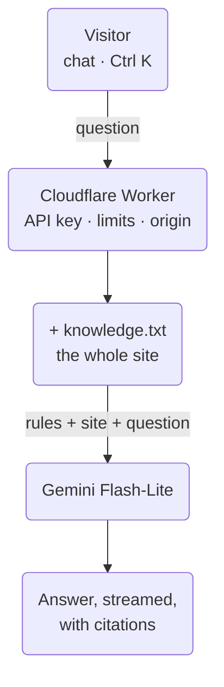

This site now has an assistant: press **Ctrl K** (or tap *Ask anything
about Paco…* on the home page) and ask it about my projects, my
experience or whether I'm available. It answers only from what's on this
site, links to where each fact comes from, and says so when it doesn't
know.

The first thing an engineer asks about a chat like this is *"is it
RAG?"*. It isn't — on purpose. Here's how it works, and why.

## How it works

1. **The knowledge.** Every time the site is built, it also generates
   `/assistant/knowledge.txt`: the same data the pages are made from —
   projects, work, the timeline, what I'm doing now, every blog entry
   and the text of my CV — as plain text. Each block says which page it
   comes from (`Source: /projects/#redcheck`). It's about 25 KB, roughly
   7,000 tokens.
2. **The Worker.** A tiny Cloudflare Worker sits between the chat and
   the model. It keeps the API key out of the browser, only answers
   requests coming from this site, allows a few questions a minute per
   visitor, caps the length of messages and history, and fetches
   `knowledge.txt` (cached for ten minutes).
3. **The model.** Gemini Flash-Lite, on the free tier, gets a short set
   of rules plus the *whole* knowledge file on every question. The rules:
   answer only from that content, talk about me in the third person,
   reply in the visitor's language, cite the page each fact comes from,
   politely decline anything off-topic, and send anything private
   (salary, for instance) to me directly.
4. **Streaming.** The answer is streamed back as it's generated, and the
   citations — written by the model as `[[/projects/#redcheck|RedCheck]]`
   — become links to that exact row of the site. Only links to this
   site's own pages are rendered; anything else is dropped.
5. **Learning from it.** Questions are logged anonymously (no IP,
   nothing that identifies anyone, deleted after 90 days), and once a
   week I get a summary — including the questions it couldn't answer
   with a source, which usually means something is missing from the
   site.

## Why not RAG

RAG — retrieval-augmented generation — splits your content into chunks,
turns them into embeddings, and on each question retrieves the few
chunks that look most similar and hands only those to the model. It's
the right tool when your content **doesn't fit** in the model's context,
or when sending all of it every time would cost too much.

Neither is true here. The whole site is ~7,000 tokens, and the model
accepts around a million. So instead of *retrieving* the relevant part,
I send all of it. That buys three things:

- **Better answers.** Retrieval can miss. The questions people actually
  ask a portfolio — *"what has he built with LLMs?"*, *"what's his
  experience?"* — span the whole site: four or five projects, a job, a
  couple of blog posts. A retriever handing over the top three chunks
  would leave some of them out, and the model would answer confidently
  from an incomplete picture. With everything in context, nothing can
  be left out.
- **Much less machinery.** No embeddings, no vector database, no
  chunking strategy, no re-indexing when something changes. I publish
  the site and the assistant already knows.
- **Still free.** Seven thousand tokens per question fits comfortably in
  the free tier. And since the start of every request — the rules plus
  the knowledge — is identical, the model provider can cache it.

The cost is that every question pays for the whole file. At this size,
that's a good trade.

## When I'd switch

RAG starts to make sense if the content grows by an order of magnitude —
dozens of long articles, well past ~100k tokens — or if I want the
assistant to answer from sources that aren't on the site, like the
READMEs and code of all my repositories. Then I'd move to retrieval
(Cloudflare Vectorize and embeddings would keep it free), probably
hybrid with keyword search — and compare both approaches with the same
evaluation set before switching.

## How I know it works

A chat that *seems* to work isn't enough, so it has an evaluation set:
twenty questions, each with the facts the answer must contain and the
things it must never say — citations present, the right language, no
invented skills, no revealing its instructions, declining a coding
request, not getting talked out of its rules. It runs on demand against
the live assistant.

First run against the live assistant: **19 of 20**. The one miss was
small but telling — asked about salary, it correctly sent the visitor to
me, but cited a page anchor that doesn't exist (`/#profile`) instead of
copying the source path exactly. Nothing broke (the link still lands on
the home page), but it's exactly what evals are for: the rule now says
to copy paths verbatim, and the eval checks every citation against the
site's real list of pages.

---

The most useful thing I took from building it: the interesting decision
wasn't *how* to build RAG, but noticing that I didn't need it yet.
