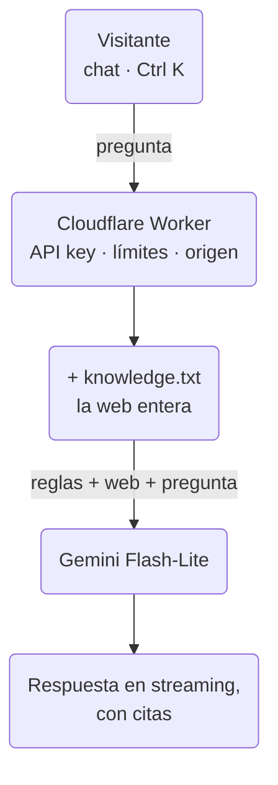

Esta web tiene ahora un asistente: pulsa **Ctrl K** (o toca *Pregunta lo
que quieras sobre Paco…* en la portada) y pregúntale por mis proyectos,
mi experiencia o si estoy disponible. Responde solo con lo que hay en
esta web, enlaza a dónde sale cada dato y lo dice cuando no lo sabe.

Lo primero que pregunta un ingeniero ante un chat así es *"¿es un
RAG?"*. No lo es, y es a propósito. Así funciona, y por qué.

## Cómo funciona

1. **El conocimiento.** Cada vez que se construye la web, se genera
   también `/assistant/knowledge.txt`: los mismos datos con los que se
   hacen las páginas — proyectos, trabajo, la trayectoria, lo que estoy
   haciendo ahora, cada entrada del blog y el texto de mi CV — en texto
   plano. Cada bloque dice de qué página sale
   (`Source: /projects/#redcheck`). Son unos 25 KB, unos 7.000 tokens.
2. **El Worker.** Un Worker muy pequeño de Cloudflare se sitúa entre el
   chat y el modelo. Mantiene la API key fuera del navegador, solo
   responde a peticiones que vienen de esta web, permite unas pocas
   preguntas por minuto a cada visitante, limita la longitud de los
   mensajes y del historial, y descarga `knowledge.txt` (con diez minutos
   de caché).
3. **El modelo.** Gemini Flash-Lite, en el plan gratuito, recibe unas
   pocas reglas y el fichero de conocimiento *entero* en cada pregunta.
   Las reglas: responder solo con ese contenido, hablar de mí en tercera
   persona, contestar en el idioma del visitante, citar la página de la
   que sale cada dato, rechazar con amabilidad lo que no venga a cuento y
   derivarme lo privado (el salario, por ejemplo).
4. **Streaming.** La respuesta llega mientras se genera, y las citas —
   que el modelo escribe como `[[/projects/#redcheck|RedCheck]]` — se
   convierten en enlaces a esa fila exacta de la web. Solo se muestran
   enlaces a páginas de esta web; cualquier otro se descarta.
5. **Aprender de él.** Las preguntas se guardan de forma anónima (sin
   IP, sin nada que identifique a nadie, se borran a los 90 días) y cada
   semana me llega un resumen, incluidas las preguntas que no pudo
   responder con una fuente, que suelen señalar algo que falta en la
   web.

## Por qué no RAG

Un RAG — *retrieval-augmented generation* — trocea tu contenido, lo
convierte en embeddings y, en cada pregunta, recupera los pocos trozos
que más se parecen y le pasa solo esos al modelo. Es la herramienta
adecuada cuando tu contenido **no cabe** en el contexto del modelo, o
cuando mandarlo entero cada vez costaría demasiado.

Aquí no pasa ninguna de las dos cosas. La web entera son ~7.000 tokens
y el modelo admite cerca de un millón. Así que, en vez de *recuperar* la
parte relevante, se la mando toda. Eso me da tres cosas:

- **Mejores respuestas.** La recuperación puede fallar. Las preguntas
  que de verdad se le hacen a un portfolio — *"¿qué ha construido con
  LLMs?"*, *"¿qué experiencia tiene?"* — abarcan toda la web: cuatro o
  cinco proyectos, un trabajo, un par de entradas del blog. Un
  recuperador que entrega los tres trozos más parecidos se dejaría
  alguno fuera, y el modelo respondería muy seguro con una imagen
  incompleta. Con todo en el contexto, no se puede quedar nada fuera.
- **Mucha menos maquinaria.** Sin embeddings, sin base de datos
  vectorial, sin estrategia de troceado, sin reindexar cuando algo
  cambia. Publico la web y el asistente ya lo sabe.
- **Sigue siendo gratis.** Siete mil tokens por pregunta caben de sobra
  en el plan gratuito. Y como el principio de cada petición — las
  reglas más el conocimiento — es siempre idéntico, el proveedor del
  modelo puede cachearlo.

El precio es que cada pregunta paga el fichero entero. A este tamaño,
compensa.

## Cuándo cambiaría

Un RAG empieza a tener sentido si el contenido crece un orden de
magnitud — decenas de artículos largos, bastante más de ~100k tokens — o
si quiero que el asistente responda con fuentes que no están en la web,
como los README y el código de todos mis repositorios. Entonces pasaría
a recuperación (Cloudflare Vectorize y sus embeddings lo mantendrían
gratis), probablemente híbrida con búsqueda por palabras clave, y
compararía los dos enfoques con el mismo conjunto de evaluación antes
de cambiar.

## Cómo sé que funciona

Un chat que *parece* funcionar no basta, así que tiene un conjunto de
evaluación: veinte preguntas, cada una con los datos que la respuesta
debe contener y lo que no debe decir nunca — citas presentes, el idioma
correcto, nada de habilidades inventadas, no revelar sus instrucciones,
rechazar una petición de programación, que no le convenzan de saltarse
sus reglas. Se ejecuta a demanda contra el asistente en producción.

*Resultados: llegarán con la primera ejecución contra el asistente en
producción.*

---

Lo más útil que me llevo de construirlo: la decisión interesante no fue
*cómo* montar un RAG, sino darme cuenta de que todavía no lo necesitaba.
